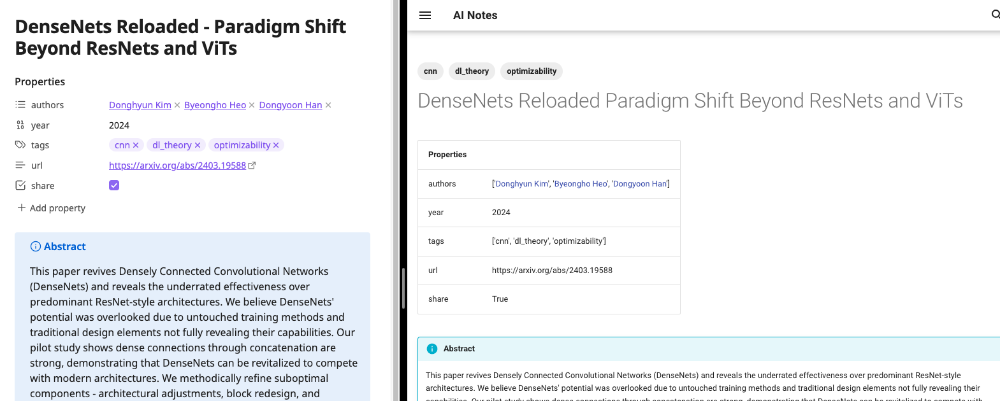

# Obsidian Dataview Properties to Table Frontmatter plugin

This plugin (wip) creates a markdown table with your dataview frontmatter properties.


Example:



## Setup

Install the plugin using pip:

```sh
pip install mkdocs-frontmatter-plugin
```

Activate the plugin in `mkdocs.yml`:

```
plugins:
  - mkdocs_frontmatter_plugin
```

TODO:
- [x] Remove `None` values
- [x] Fix the exclude config
- [x] Remove quotes around roamlinks
- [x] Add support for hyperlinks
- [x] Don't display frontmatter if it is empty


